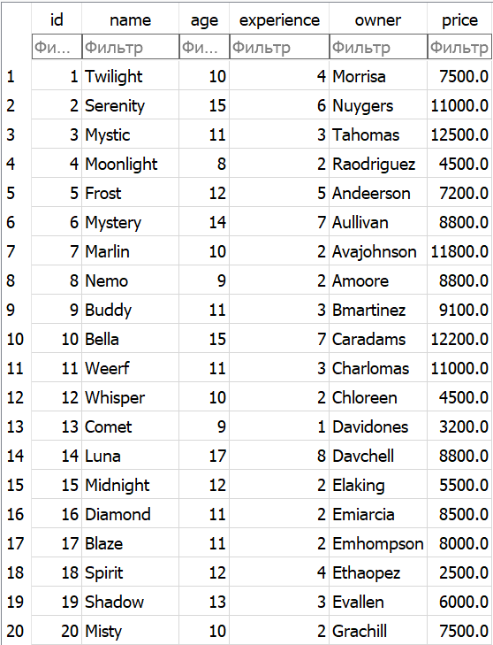
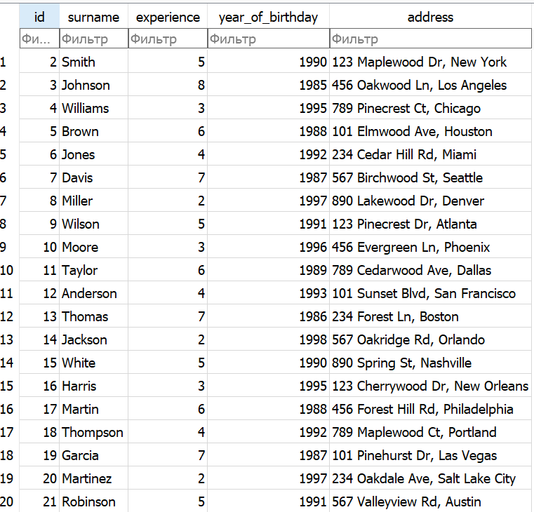
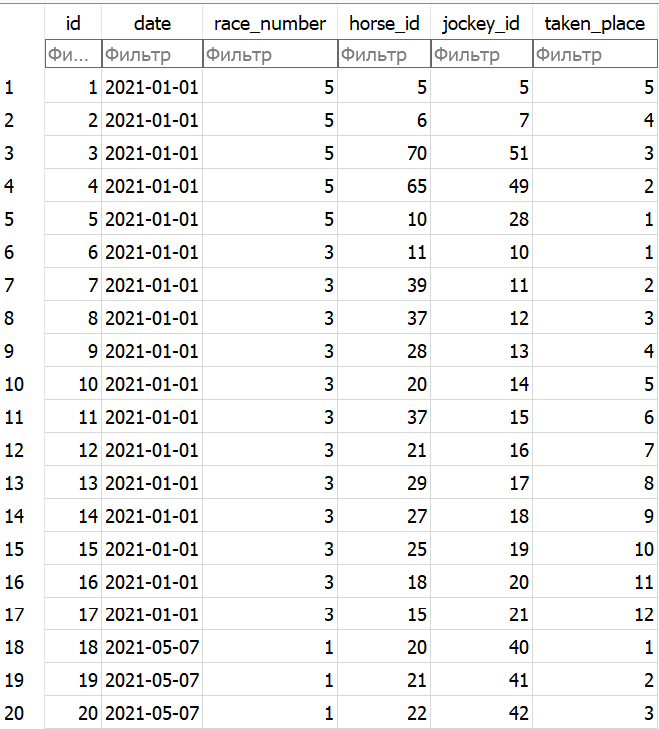
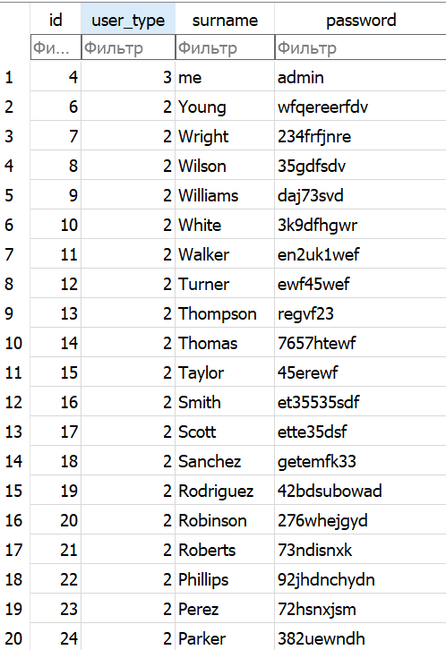
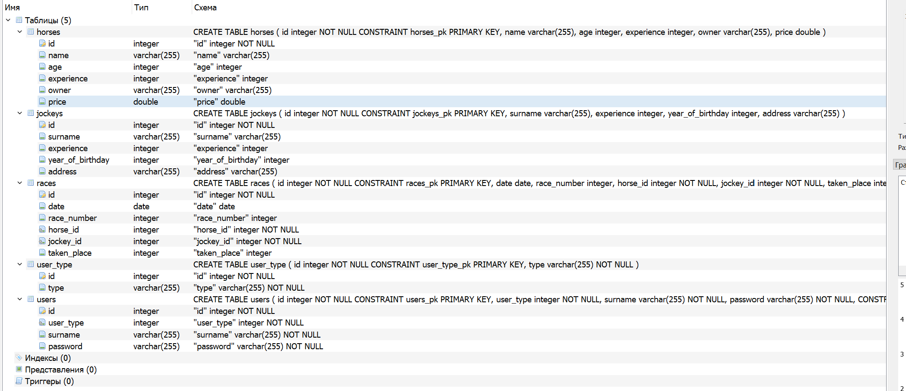

## Содержание баз данных:
# Структура базы данных

Этот файл README описывает структуру таблиц базы данных, используемых в проекте, детализируя назначение и типы данных каждого столбца в этих таблицах. Ниже приведены описания каждой таблицы вместе с примерами данных, которые они могут содержать.

## Таблицы

### 1. Лошади (Horses)

**Назначение**: Эта таблица хранит информацию о лошадях.

| Столбец     | Тип данных | Описание                          |
|-------------|------------|-----------------------------------|
| id          | integer    | Уникальный идентификатор лошади   |
| name        | varchar    | Имя лошади                        |
| age         | integer    | Возраст лошади                    |
| experience  | integer    | Уровень опыта лошади              |
| owner       | varchar    | Имя владельца лошади              |
| price       | double     | Цена лошади                       |

#### Пример данных

    

### 2. Жокеи (Jockeys)

**Назначение**: Таблица содержит информацию о жокеях.

| Столбец        | Тип данных | Описание                               |
|----------------|------------|----------------------------------------|
| id             | integer    | Уникальный идентификатор жокея         |
| surname        | varchar    | Фамилия жокея                          |
| experience     | integer    | Опыт работы жокея                      |
| year_of_birth  | integer    | Год рождения жокея                     |
| address        | varchar    | Адрес жокея                            |

#### Пример данных

    
### 3. Гонки (Races)

**Назначение**: В этой таблице содержится информация о гонках.

| Столбец      | Тип данных | Описание                                     |
|--------------|------------|----------------------------------------------|
| id           | integer    | Уникальный идентификатор гонки               |
| date         | date       | Дата проведения гонки                        |
| race_number  | integer    | Номер гонки                                  |
| horse_id     | integer    | Идентификатор лошади, участвующей в гонке    |
| jockey_id    | integer    | Идентификатор жокея, участвующего в гонке    |
| taken_place  | integer    | Место, которое заняла лошадь в гонке         |

#### Пример данных

### 4. Пользователи (Users)

**Назначение**: Таблица для хранения информации о пользователях системы.

| Столбец     | Тип данных | Описание                           |
|-------------|------------|------------------------------------|
| id          | integer    | Уникальный идентификатор пользователя |
| user_type   | integer    | Тип пользователя (ссылка на таблицу user_type) |
| surname     | varchar    | Фамилия пользователя               |
| password    | varchar    | Пароль пользователя                |

#### Пример данных

 
    
 ### Структука БД скриншотом из DB Browser for SQL:
 