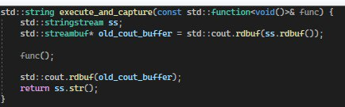

## Обзор тестов

Для тестирования использовали библиотеку для тестов catch2. Для тестирование использовали замену стандартного потока cin на поток с тестовыми входными данными

### Вывод в консоль:

### Инициализация тестовой бд

### Тест класса Autentification

### Тест класса Admin

### Тест класса Owner

### Тест класса Jockey

### Вспомогательная функци для захвата потока

